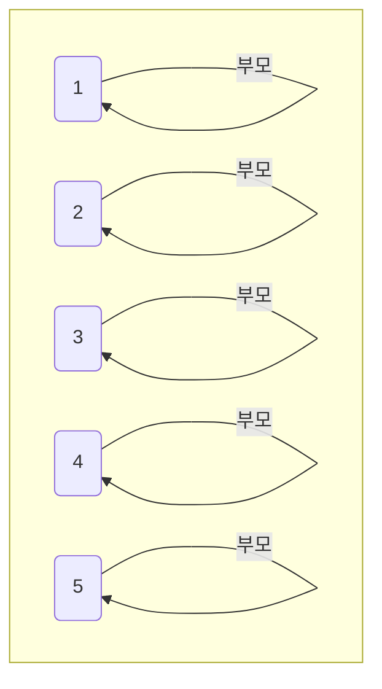
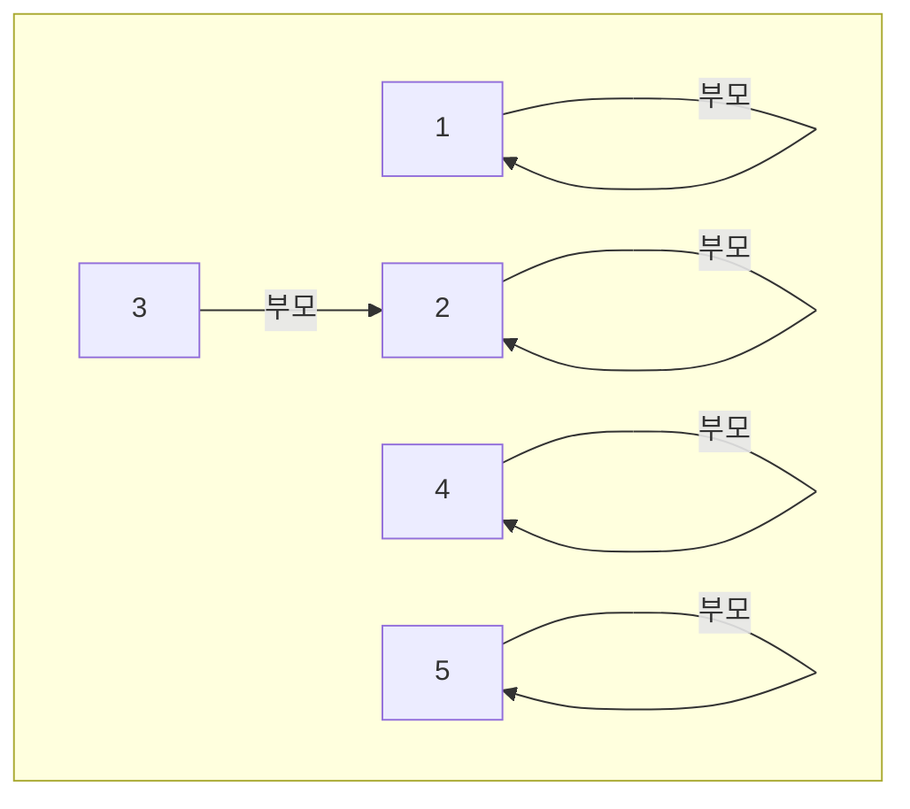
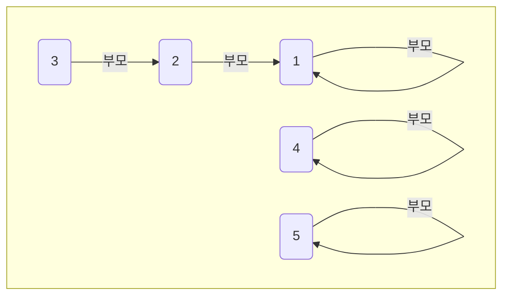
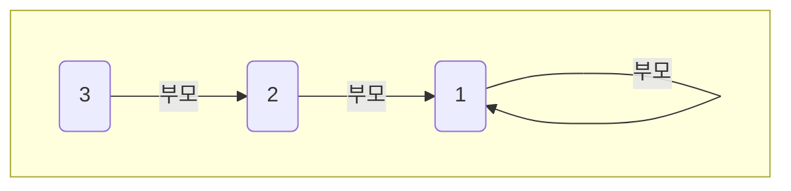
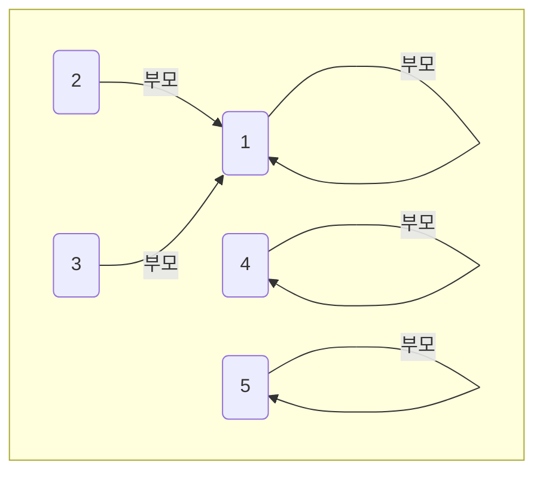

> **유니온 파인드(Union Find)**: 서로소 집합을 처리하는 자료구조로, 두 개의 노드가 같은 집합에 속하는지 확인하거나, 두 집합을 하나로 합치는 연산을 제공한다. 이 알고리즘은 그래프 탐색에서 사이클을 판별하거나, **최소 신장 트리(MST)**를 찾을 때 자주 사용된다.

## 1️⃣ 유니온 파인드의 기본 연산

유니온 파인드는 **Union(합집합)** 연산과 **Find(찾기)** 연산으로 이루어진다.

- Union 연산
  - 두 개의 집합을 하나로 합친다.
  - `union(x, y)` 연산을 수행하면, 노드 `x` 와 `y` 가 속한 두 집합을 하나로 합친다.
- Find 연산
  - 특정 노드가 어느 집합에 속하는지 찾는다.
  - `find(x)` 를 호출하면 노드 `x` 가 속한 집합의 대표 노드를 찾을 수 있다.

## 2️⃣ 유니온 파인드 순서

### 1. 초기상태

각 노드는 자기 자신을 부모로 가리키며 독립적인 상태이다.



| 노드 번호 | 1   | 2   | 3   | 4   | 5   |
| --------- | --- | --- | --- | --- | --- |
| 부모      | 1   | 2   | 3   | 4   | 5   |

```kotlin
// 부모를 저장하는 배열(index 1 ~ 5 사용)
val parent = IntArray(6) { it }
```

### 2. Union(합집합) 연산 - 2과 3 연결

`union(2, 3)` 를 호출하면, 2와 3을 같은 집합으로 묶는다. 2와 3의 최상위 부모를 `find(x)` 연산을 통해 찾아낸 뒤에 부모 중 더 작은 값인 2가 3의 부모가 된다.



| 노드 번호 | 1   | 2   | 3   | 4   | 5   |
| --------- | --- | --- | --- | --- | --- |
| 부모      | 1   | 2   | 2   | 4   | 5   |

```kotlin
// 두 집합을 합친다.
fun union(x: Int, y: Int) {
    val rootX = find(x)
    val rootY = find(y)

    // 이미 같은 집합에 속해 있으면 합치지 않는다.
    if(rootX != rootY) {
        // 더 작은 값을 부모로 설정
        if(rootX < rootY) {
            parent[rootY] = rootX
        }
        else {
            parent[rootX] = rootY
        }
    }
}
```

### 3. Union(합집합) 연산 - 1과 2 연결

`union(1, 2)` 을 호출하면, 1과 2가 같은 집합으로 묶이고, 2의 부모는 1이 됩니다.



| 노드 번호 | 1   | 2   | 3   | 4   | 5   |
| --------- | --- | --- | --- | --- | --- |
| 부모      | 1   | 1   | 2   | 4   | 5   |

### 4. Find(찾기) 연산 - 3의 부모 찾기

`find(3)` 을 호출하면, 3의 부모를 찾을 수 있다.
3 → 부모 2 → 부모 1로 확인되며, 최종적으로 3의 최상위 부모(대표)는 1이다.



```kotlin
// 특정 노드가 속한 집합의 대표를 찾는다 (경로 압축 없음)
fun find(x: Int): Int {
    if(parent[x] != x) {
        return find(parent[x]) // 부모를 찾아가며 재귀적으로 호출
    }
    return x
}
```

#### 🚨 Find 연산의 문제점

- 트리의 깊이가 깊어지면 탐색 시간이 길어진다.
- 이를 해결하기 위해 **경로 압축(Path Compression)**을 적용한다.

### 5. 경로 압축 (Path Compression) 적용

`find(x)` 연산을 수행할 때, 부모 노드를 최상위 부모로 갱신하여 이후 탐색 시간을 줄일 수 있다.



| 노드 번호 | 1   | 2   | 3   | 4   | 5   |
| --------- | --- | --- | --- | --- | --- |
| 부모      | 1   | 1   | 1   | 4   | 5   |

```kotlin
// 특정 노드가 속한 집합의 대표를 찾는다. (경로 압축 있음)
fun find(x: Int): Int {
    if(parent[x] != x) {
        // 경로 압축: 부모를 최상위 부모로 갱신
        parent[x] = find(parent[x])
    }
    return parent[x]
}
```

## 3️⃣ 예시 코드

```kotlin
// 부모를 저장하는 배열(index 1 ~ 5 사용)
val parent = IntArray(6) { it }

// 두 집합을 합친다.
fun union(x: Int, y: Int) {
    val rootX = find(x)
    val rootY = find(y)

    // 이미 같은 집합에 속해 있으면 합치지 않는다.
    if(rootX != rootY) {
        // 더 작은 값을 부모로 설정
        if(rootX < rootY) {
            parent[rootY] = rootX
        }
        else {
            parent[rootX] = rootY
        }
    }
}

// 특정 노드가 속한 집합의 대표를 찾는다.
fun find(x: Int): Int {
    if(parent[x] != x) {
        // 경로 압축: 부모를 최상위 부모로 갱신
        parent[x] = find(parent[x])
    }
    return parent[x]
}

// 두 노드가 같은 집합에 속하는지 확인
fun isConnected(x: Int, y: Int): Boolean {
    return find(x) == find(y)
}

// 사용 예시
fun main() {
    // 2와 3을 합친다.
    union(2, 3)
    println("2와 3은 같은 집합에 속하는가? ${isConnected(2, 3)}") // true

    // 1과 2를 합친다.
    union(1, 2)
    println("1과 2는 같은 집합에 속하는가? ${isConnected(1, 2)}") // true

    // 1과 3이 같은 집합에 속하는지 확인
    println("1과 3은 같은 집합에 속하는가? ${isConnected(1, 3)}") // true

    // 4와 5는 아직 연결되지 않았으므로 false
    println("4와 5는 같은 집합에 속하는가? ${isConnected(4, 5)}") // false

    // 4와 5를 합친다.
    union(4, 5)
    println("4와 5는 같은 집합에 속하는가? ${isConnected(4, 5)}") // true
}
```

## 🔥 정리

- Union 연산
  - 두 개의 집합을 하나로 합친다.
  - 더 작은 값이 부모가 되는 방식으로 합친다.
- Find 연산
  - 부모를 따라가며 최상위 부모(대표)를 찾는다.
  - 트리의 깊이가 깊어지면 탐색 시간이 길어질 수 있다.
- 경로 압축
  - Find를 수행하며 부모를 최상위 부모로 갱신한다.
  - 이후 탐색 속도를 O(1)에 가깝게 유지할 수 있다.
- 유니온 파인드는 O(1)에 가까운 시간 복잡도를 가진다.
