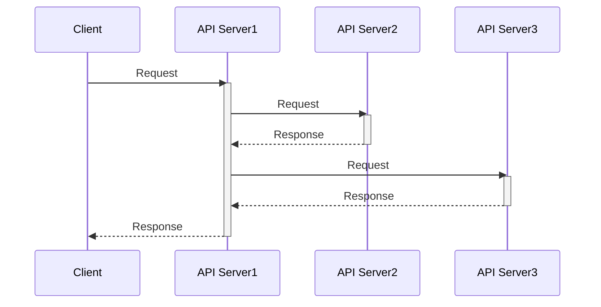
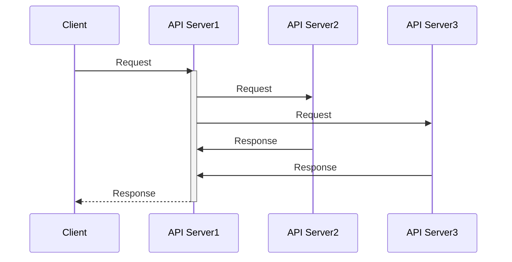

## 1. I/O(Input & Output)

- 컴퓨터 시스템이 외부 입출력 장치들과 데이터를 주고받는 것을 의미한다.
- 웹 애플리케이션에서는 데이터베이스 CRUD 작업, 다른 애플리케이션과의 통신 등이 이에 해당한다.

## 2. Blocking I/O



- 위 예시 동작 과정
  1. 클라이언트가 API Server1에 요청을 보낸다.
  2. API Server1은 API Server2에 요청을 보내고, 응답을 받을 때까지 스레드가 차단된다.
  3. API Server2에서 응답을 반환하면 API Server1의 차단된 스레드가 다시 실행되어 API Server3에 요청을 보낸다.
  4. API Server3에서 응답을 반환할 때까지 API Server1의 스레드는 다시 차단된다.
  5. API Server3에서 응답을 반환하면 API Server1이 클라이언트에게 최종 응답을 보낸다.
- 하나의 스레드가 I/O 작업이 완료될 때까지 차단되는 방식이다.
- 클라이언트가 API 서버에 요청을 보내면, 서버 내부적으로 다른 API 서버에 요청을 보내고, 응답을 받을 때까지 스레드가 차단된다.
- 스레드가 차단되기 때문에 응답을 받을 때까지 대기해야 한다.
- 이를 보완하기 위해 멀티스레드를 사용하여 차단된 시간을 효율적으로 활용할 수 있다.

## 3. 멀티스레드

- 하나의 프로세스 내에서 둘 이상의 스레드가 동시에 작업을 수행하는 방식이다.
- 여러 요청을 동시에 처리할 수 있어 Blocking I/O 방식의 문제를 일부 해결할 수 있다.
- 그러나 컨텍스트 스위칭 비용, 과다한 메모리 사용, 스레드 풀 과부하 등의 문제점이 발생할 수 있다.

## 4. Non-Blocking I/O



- 위 예시 동작 과정
  1. 클라이언트가 API Server1에 요청을 보낸다.
  2. API Server1은 API Server2와 API Server3에 각각 요청을 보낸다. 이 과정에서 스레드는 차단되지 않는다.
  3. API Server2와 API Server3에서 응답이 오면 API Server1이 이를 처리하여 클라이언트에게 최종 응답을 보낸다.
- 하나의 스레드가 I/O 작업이 완료될 때까지 차단되지 않는 방식이다.
- 요청을 보내고 응답을 기다리는 동안 다른 작업을 수행할 수 있다.
- 하나의 스레드로 많은 요청을 처리할 수 있어 성능이 향상된다.
- CPU 연산이 많은 작업이 포함될 경우 성능이 저하될 수 있다.
- 요청-응답 과정에서 Blocking I/O 요소가 포함되면 성능 개선 효과가 감소할 수 있다.

## 5. Spring에서의 Blocking I/O와 Non-Blocking I/O

- **Spring MVC**는 Blocking I/O 방식을 사용한다.
  - 요청당 하나의 스레드를 사용하는 멀티스레드 방식이다.
  - 대량의 요청이 발생하면 과도한 스레드 사용으로 CPU 대기 시간이 증가하고, 메모리 사용량이 증가하여 오버헤드가 발생한다.
- **Spring WebFlux**는 Non-Blocking I/O 방식을 사용한다.
  - 반응형 프로그래밍(Reactive Programming)을 구현하기 위해 Reactor 라이브러리를 사용한다.
  - Netty 같은 비동기 Non-Blocking I/O 기반의 서버 엔진을 사용하여 적은 수의 스레드로 많은 요청을 처리할 수 있다.
  - CPU와 메모리를 효율적으로 사용하여 고성능 애플리케이션 운영이 가능하다.

## 6. Blocking I/O, Non-Blocking I/O 예시 코드

- Blocking I/O와 Non-Blocking I/O 예제를 코드로 구현하는 과정이다.
- IntelliJ, Java 17, Spring Webflux를 사용한다.


1. Empty Project를 생성한다.

### API Server1

- 클라이언트의 요청을 받아 API Server2, API Server3에 요청을 보내고 응답을 받아 가공 후 클라이언트에게 반환한다.


1. 생성된 `Empty Project`를 우클릭하고 `New` -> `Module`를 클릭한다.

 2. SpringBoot를 클릭하고 Name에 `api-server-1`을 입력한다. Language는 `Java`, Type은 `Gradle-Groovy`를 선택한다.

 3. `Spring Reactive Web` 의존성을 추가해준다.


1. 프로젝트에 `TestController`, `TestResponse` 파일을 추가한다.

```java
// TestCotroller
import org.springframework.web.bind.annotation.GetMapping;
import org.springframework.web.bind.annotation.PathVariable;
import org.springframework.web.bind.annotation.RestController;
import org.springframework.web.client.RestTemplate;
import org.springframework.web.reactive.function.client.WebClient;
import reactor.core.publisher.Mono;

@RestController
public class TestController {

    private final RestTemplate restTemplate = new RestTemplate();

    @GetMapping("/api-server-1/v1/test/{id}")
    public TestResponse v1_blocking(@PathVariable String id) {

        String url = "http://localhost:8081/api-server-2/test/" + id;
        String fromApiServer2 = restTemplate.getForObject(url, String.class);

        url = "http://localhost:8082/api-server-3/test/" + id;
        String fromApiServer3 = restTemplate.getForObject(url, String.class);

        return new TestResponse(fromApiServer2, fromApiServer3);
    }

    @GetMapping("/api-server-1/v2/test/{id}")
    public Mono<TestResponse> v2_non_blocking(@PathVariable String id) {

        String url = "http://localhost:8081/api-server-2/test/" + id;
        Mono<String> fromApiServer2 = WebClient.create()
            .get()
            .uri(url)
            .retrieve()
            .bodyToMono(String.class);

        url = "http://localhost:8082/api-server-3/test/" + id;
        Mono<String> fromApiServer3 = WebClient.create()
            .get()
            .uri(url)
            .retrieve()
            .bodyToMono(String.class);

        return Mono.zip(fromApiServer2, fromApiServer3)
            .map(tuple -> new TestResponse(tuple.getT1(), tuple.getT2()));
    }
}

```

```java
public class TestResponse {

    private String fromApiServer2;

    private String fromApiServer3;

    public TestResponse() {
    }

    public TestResponse(String fromApiServer2, String fromApiServer3) {
        this.fromApiServer2 = fromApiServer2;
        this.fromApiServer3 = fromApiServer3;
    }

    public String getFromApiServer2() {
        return fromApiServer2;
    }

    public void setFromApiServer2(String fromApiServer2) {
        this.fromApiServer2 = fromApiServer2;
    }

    public String getFromApiServer3() {
        return fromApiServer3;
    }

    public void setFromApiServer3(String fromApiServer3) {
        this.fromApiServer3 = fromApiServer3;
    }
}

```

### API Server2

- API 요청을 받고 5초 뒤에 응답을 반환하는 서버이다.

1. API Server1과 동일하게 프로젝트를 생성한다.
2. API Server1과 동일한 경로에 `TestController`를 생성한다.

```java
import org.springframework.web.bind.annotation.GetMapping;
import org.springframework.web.bind.annotation.PathVariable;
import org.springframework.web.bind.annotation.RestController;

@RestController
public class TestController {

    @GetMapping("/api-server-2/test/{id}")
    public String test(@PathVariable String id) throws InterruptedException {

        Thread.sleep(5000);

        return "api-server-2 response: " + id;
    }
}
```

3. 내장 톰캣 포트를 8081로 변경한다.

```properties
# api-server-2/src/main/resources/application.properties
server.port=8081
```

### API Server3

- API Server2와 동일하게 API 요청을 받고 5초 뒤에 응답을 반환한다.

1. API Server1과 동일하게 프로젝트를 생성한다.
2. API Server1과 동일한 경로에 `TestController`를 생성한다.

```java
import org.springframework.web.bind.annotation.GetMapping;
import org.springframework.web.bind.annotation.PathVariable;
import org.springframework.web.bind.annotation.RestController;

@RestController
public class TestController {

    @GetMapping("/api-server-3/test/{id}")
    public String test(@PathVariable String id) throws InterruptedException {

        Thread.sleep(5000);

        return "api-server-3 response: " + id;
    }
}
```

3. 내장 톰캣 포트를 8082로 변경한다.

```properties
# api-server-3/src/main/resources/application.properties
server.port=8082
```

### Client

- IntelliJ의 `.http` 파일을 사용하여 API Server1에 요청을 보낸다.
- 각각 5번의 요청을 보낸다.

```shell

### Blocking I/O

GET http://localhost:8080/api-server-1/v1/test/1

### Non-Blocking I/O

GET http://localhost:8080/api-server-1/v2/test/2
```

### 정리

- V1 (Blocking I/O) 방식은 각 요청당 약 10초가 소요된다. (API Server2에서 5초, API Server3에서 5초가 걸리기 때문)
  - API Server1이 API Server2에 요청을 보낸 후 응답을 받을 때까지 대기하고, 이후 API Server3에 요청을 보내 다시 대기하는 구조라서 총 10초가 소요된다.
  - 요청이 많아질수록 API Server1의 스레드가 차단되면서 처리 속도가 저하된다.
- V2 (Non-Blocking I/O) 방식은 각 요청당 약 5초가 소요된다. (API Server2와 API Server3에 동시에 요청을 보내기 때문)
  - API Server1이 API Server2와 API Server3에 동시에 요청을 보내고, 응답이 오는 즉시 데이터를 가공하여 클라이언트에 반환한다.
  - 처리 시간이 줄어들고, 동시 요청 처리 성능이 향상된다.
- Blocking I/O 방식은 요청이 많아질수록 서버의 자원이 낭비되고 응답 속도가 느려지는 단점이 있다.
- Non-Blocking I/O 방식은 더 많은 요청을 동시에 처리할 수 있어 고성능 시스템에 적합하다.
- 전체 실행 코드는 [GITHUB](https://github.com/mrpark219/blocking-non-blocking-study){:target="\_blank"}를 참고하면 된다.
