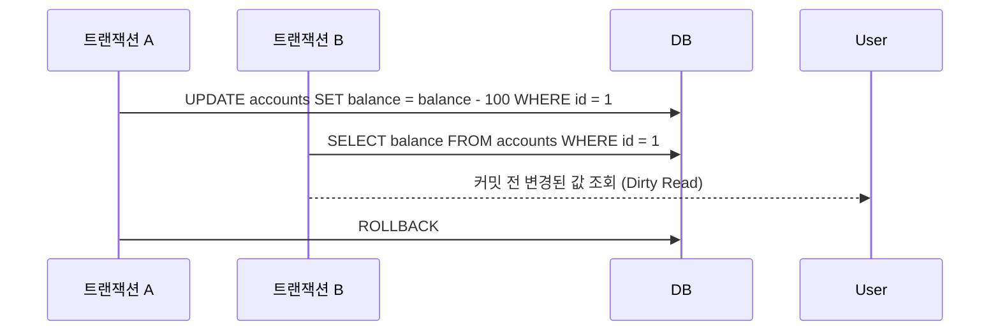
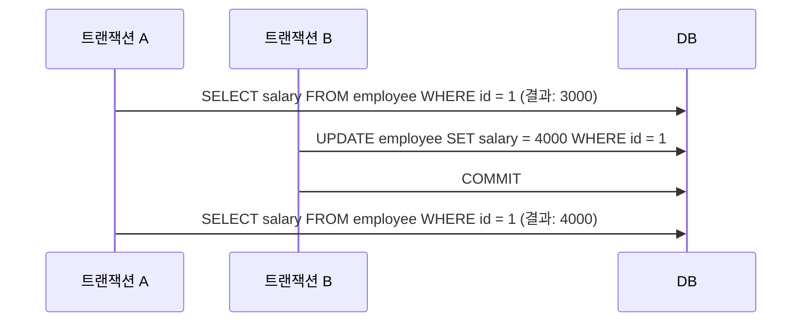
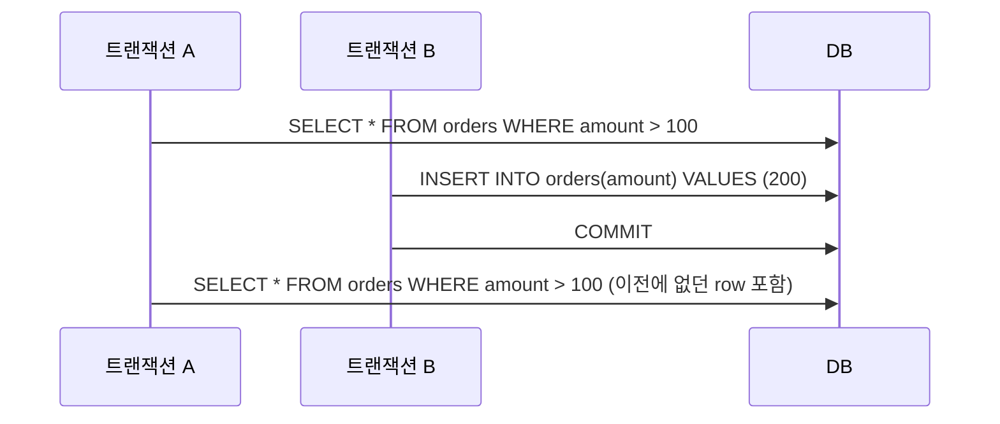

## 1. 트랜잭션의 격리 수준 (Transaction Isolation Level)

- 여러 트랜잭션이 동시에 처리될 때, 한 트랜잭션이 다른 트랜잭션의 데이터 변경이나 조회 결과를 볼 수 있도록 허용할지 여부를 결정하는 기준이다.
- 격리 수준은 **동시성 성능과 데이터 일관성 보장 간의 trade-off**를 조절하는 역할을 한다.
- 격리 수준은 아래와 같이 **높은 순서(= 더 엄격한 순서)**로 나열된다:
  - `SERIALIZABLE`
  - `REPEATABLE READ`
  - `READ COMMITTED`
  - `READ UNCOMMITTED`

## 2. SERIALIZABLE

- 가장 높은 수준의 격리 단계이며, **트랜잭션을 마치 순차적으로 처리하는 것처럼 보이게 만든다**.
- 모든 트랜잭션이 **동시에 동일한 데이터를 조회하거나 수정하는 것을 허용하지 않는다**.
- **팬텀 리드(phantom read)**, **반복 불가능한 읽기(non-repeatable read)**, **더러운 읽기(dirty read)** 등 모든 문제가 발생하지 않도록 방지한다.
- 완벽한 일관성을 보장하지만, 그만큼 **동시 처리 성능은 가장 낮다**.
- 주로 데이터 정확성이 가장 중요한 금융/회계 시스템 등에서 사용한다.

## 3. REPEATABLE READ

- 동일 트랜잭션 내에서 **같은 쿼리를 여러 번 실행해도 항상 동일한 결과를 보장한다**.
- **반복 불가능한 읽기(non-repeatable read)** 와 **더러운 읽기(dirty read)** 를 방지할 수 있다.
- 하지만 **팬텀 리드(phantom read)** 는 방지하지 못한다.
- MySQL의 InnoDB 엔진에서는 기본 격리 수준이 `REPEATABLE READ`이며, 일반적으로는 팬텀 리드까지 방지하도록 구현되어 있다.
- 하지만 `SELECT ... FOR UPDATE` 쿼리에서는 팬텀 리드가 발생한다.



```sql
-- 트랜잭션 A
SET SESSION TRANSACTION ISOLATION LEVEL READ UNCOMMITTED;
START TRANSACTION;
UPDATE accounts SET balance = balance - 100 WHERE id = 1;

-- 트랜잭션 B
SET SESSION TRANSACTION ISOLATION LEVEL READ UNCOMMITTED;
START TRANSACTION;
SELECT balance FROM accounts WHERE id = 1;

-- 트랜잭션 A
ROLLBACK;
```

## 4. READ COMMITTED

- 대부분의 상용 DBMS에서 기본값으로 설정되어 있는 격리 수준이다.
- **트랜잭션이 커밋한 데이터만 읽을 수 있도록 허용한다**.
- **더러운 읽기(dirty read)** 는 방지할 수 있지만, **반복 불가능한 읽기**와 **팬텀 리드**는 발생할 수 있다.
- 트랜잭션 중 같은 SELECT를 여러 번 수행해도 결과가 바뀔 수 있기 때문에 주의가 필요하다.
- Oracle의 기본 격리 수준이 `READ COMMITTED`이다.



```sql
-- 트랜잭션 A
SET SESSION TRANSACTION ISOLATION LEVEL READ COMMITTED;
START TRANSACTION;
SELECT salary FROM employee WHERE id = 1;

-- 트랜잭션 B
SET SESSION TRANSACTION ISOLATION LEVEL READ COMMITTED;
START TRANSACTION;
UPDATE employee SET salary = 4000 WHERE id = 1;
COMMIT;

-- 트랜잭션 A
SELECT salary FROM employee WHERE id = 1;
```

## 5. READ UNCOMMITTED

- 가장 낮은 수준의 격리 단계이다.
- 다른 트랜잭션에서 아직 커밋하지 않은 **미완료 데이터까지 읽는 것이 가능하다**.
- 따라서 **더러운 읽기(dirty read)** 가 발생할 수 있다.
- 트랜잭션 간 간섭이 거의 없기 때문에 **성능은 높지만, 데이터 일관성은 매우 낮다**.
- 일반적으로 실무에서는 거의 사용하지 않는다.



```sql
-- 트랜잭션 A
SET SESSION TRANSACTION ISOLATION LEVEL REPEATABLE READ;
START TRANSACTION;
SELECT * FROM orders WHERE amount > 100;

-- 트랜잭션 B
SET SESSION TRANSACTION ISOLATION LEVEL REPEATABLE READ;
START TRANSACTION;
INSERT INTO orders(amount) VALUES (200);
COMMIT;

-- 트랜잭션 A
SELECT * FROM orders WHERE amount > 100;
```

## 6. 격리 수준별 허용되는 현상 정리

| 격리 수준        | Dirty Read | Non-Repeatable Read | Phantom Read |
| ---------------- | ---------- | ------------------- | ------------ |
| READ UNCOMMITTED | ✅         | ✅                  | ✅           |
| READ COMMITTED   | ❌         | ✅                  | ✅           |
| REPEATABLE READ  | ❌         | ❌                  | ✅           |
| SERIALIZABLE     | ❌         | ❌                  | ❌           |
